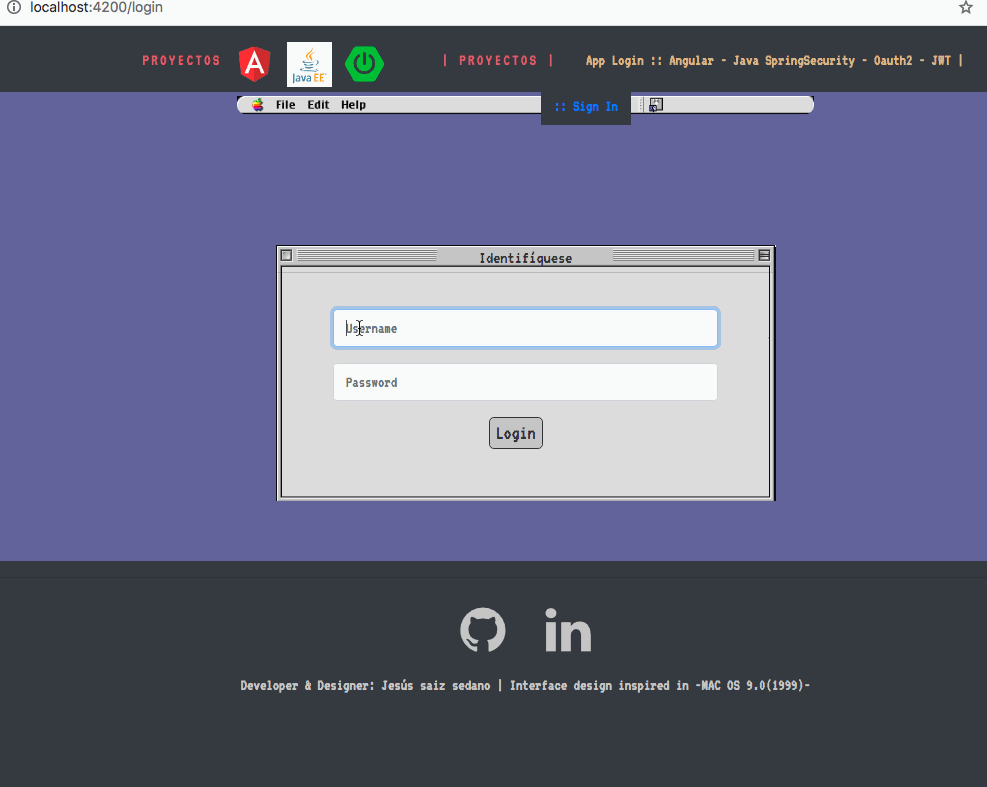

# AppSecurity
This is a tiny app where implements Security roles and paths by a login to enter the application according to your role (admin, user) using credentials.

The project was generated with the following tecnologies: 

Front-end: Angular version 8.3.13, OAUTH-JWT

Back-end: Java EE, SpringSecurity-OAUTH2-JWT

***important***
SOON YOU WILL TEST ONLINE THE APP WITH FIREBASE

# Images of the ChatApp

# Development server
Download the app: install the front-end in angular and the back-end in java(eclipse or springtool)

FIRST:
Run the app in Java run the app with Spring

Next in angular run the app with ng serve -o (localhost:4200/chat)

Copy the link in your browser in another browser to testing the app.

